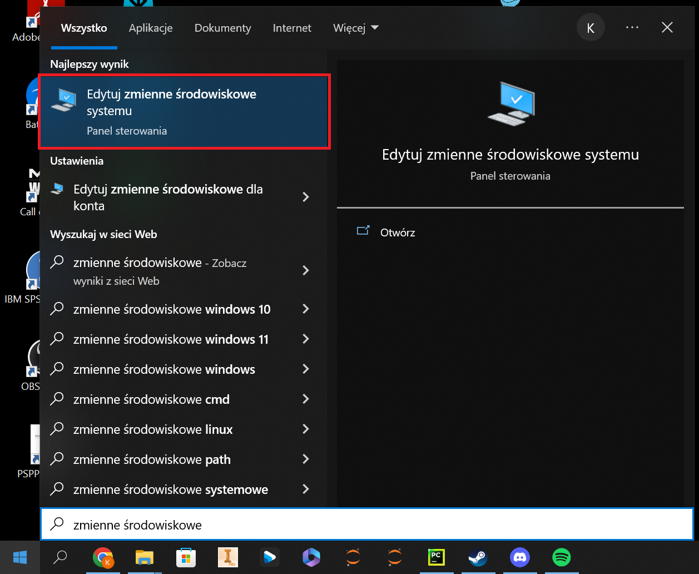
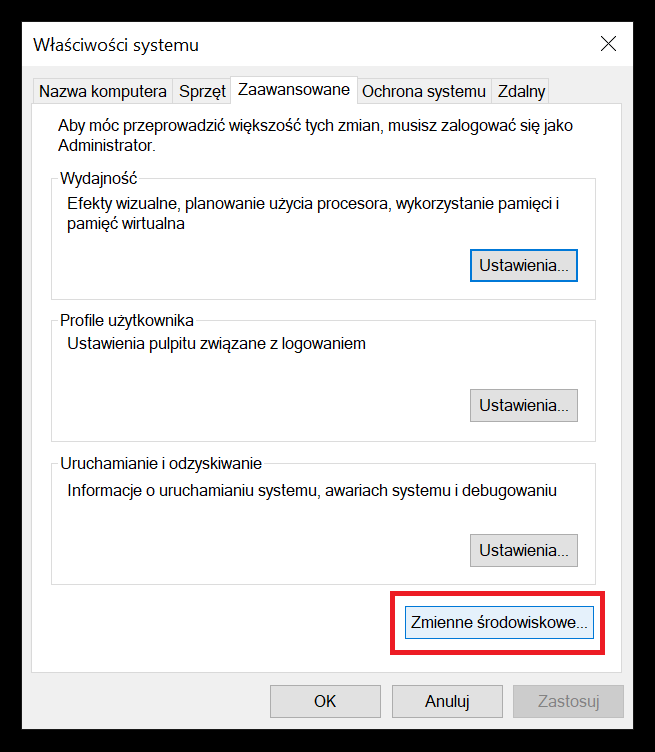
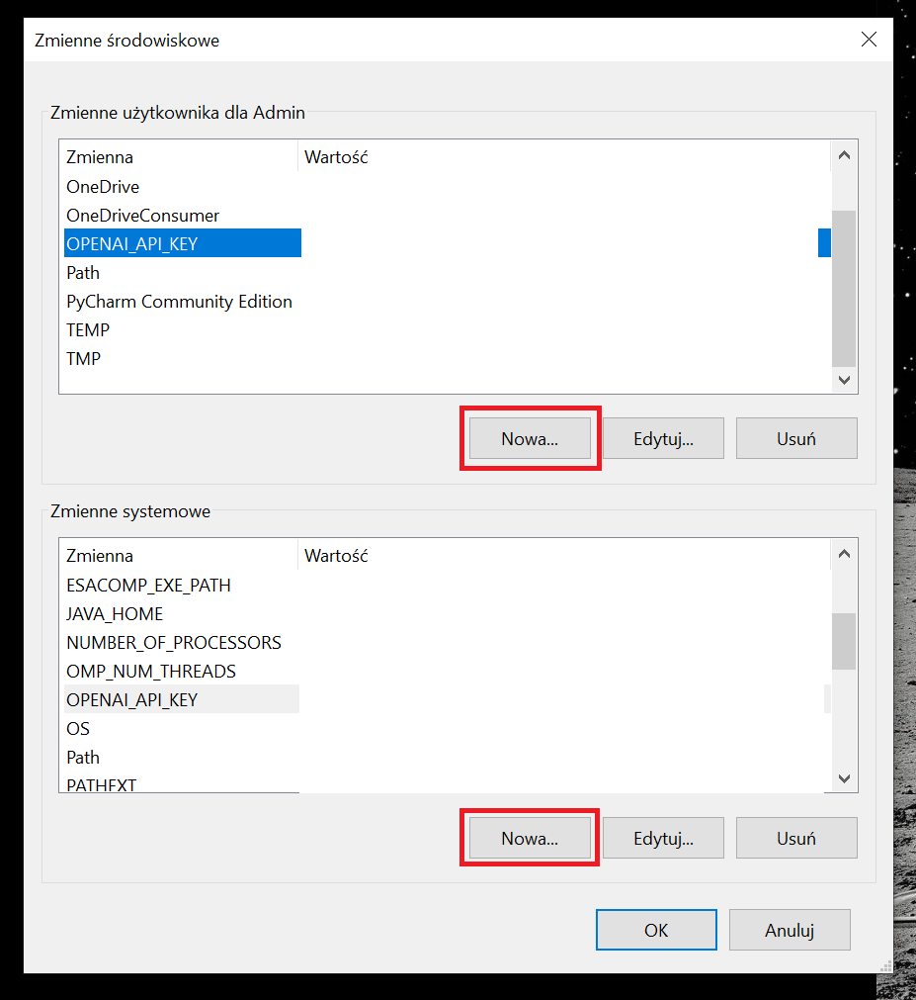
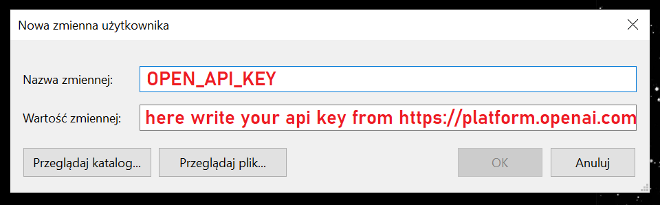
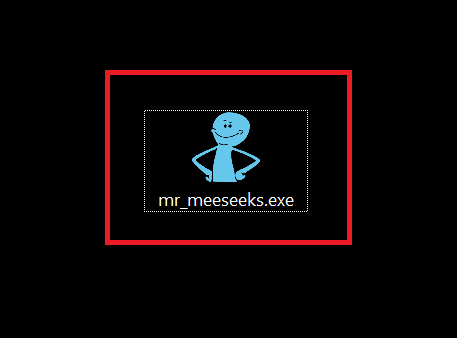
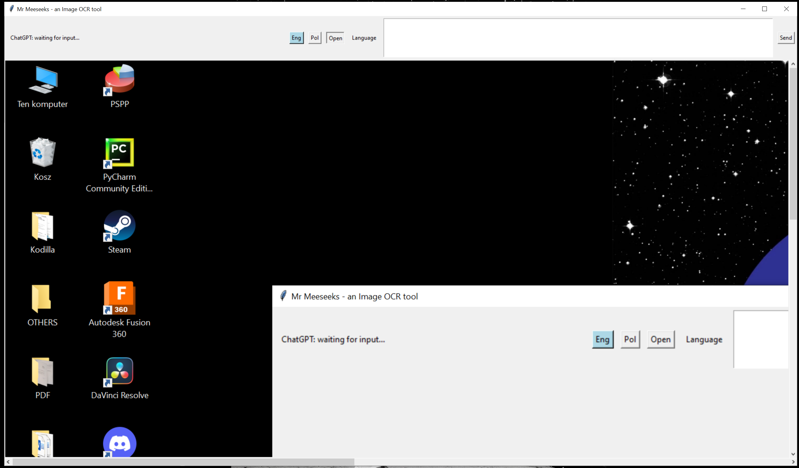
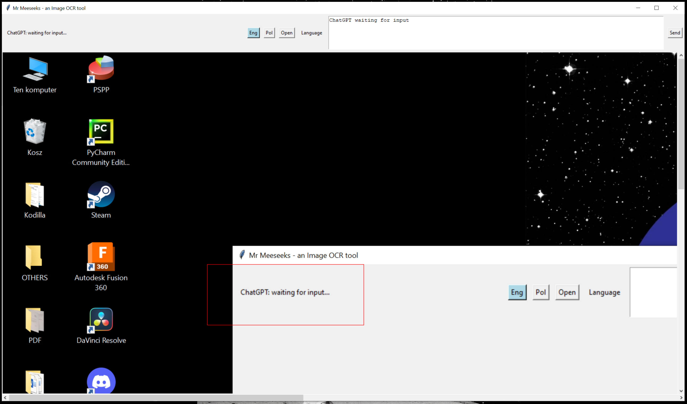
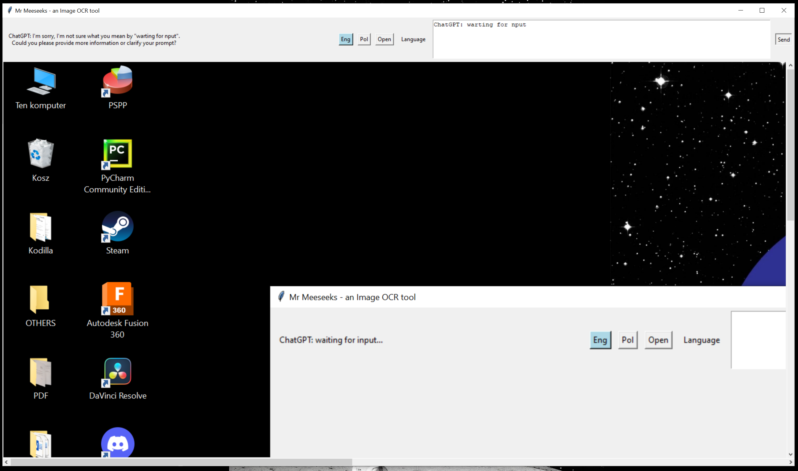

# AUTOMATE OCR - AKA Mr Meeseeks to the rescue!

This is a Python script for an OCR (Optical Character Recognition) tool that allows the user to extract text from an image and send it to a chatbot for processing.

The script uses the Tkinter library to create a GUI for the user to interact with. The GUI consists of a canvas where the user can select an area of the image to extract text from, a text widget where the extracted text is displayed, and a set of buttons to interact with the chatbot and change the language used for OCR.

The script uses the PIL (Python Imaging Library) library to read the image file, OpenCV to extract the selected area from the image and pytesseract for OCR. The extracted text is then sent to the OpenAI API using their GPT (Generative Pre-trained Transformer) model for processing.

Overall, the script is a useful tool for quickly extracting text from an image and using it for further processing, such as generating a response from a chatbot.

## Installation

You can download the "Mr_meeseeks.exe" it's located in dist/.
For it to run you should have own an account on [https://platform.openai.com/](https://platform.openai.com/).
Right now you can create a free account (based on IV 2023).
Generate OPEN_API_KEY and add it to /PATH/:

Step 1. OPEN WINDOWS MENU AND WRITE "Environment Variables" or If you have different language, let's say in polish: "Zmienne środowiskowe":

Step 2. CLICK BUTTON "Environment Variables" or If you have different language, let's say in polish: "Zmienne środowiskowe":

Step 3. ADD 2 NEW PATH:

Step 4. PROPERLY NAME THE VARIABLE AND ADD YOUR KEY WHICH YOU HAVE GENERATED EARLIER:

## How it works?

1. Open "Mr_meeseeks.exe"

2. Click "PRINT SCREEN" on your keyboard.
3. Click "Open" in "Mr_meeseeks.exe" app top menu bar.

4. Choose the language (top menu bar in the app).
5. Mark what you would like to read (with a mouse make a red rectangular).

When you release left mouse button, marked text will be read by OCR and copied into top bar.
Some mistakes can happen - this app is work in progress - you can edit the querry to ChatGPT before sending.

6. Click button "Send" (in the left top bar of the app) and wait for result

My experiences with this script shows that about 80% of text is being read properly. App still struggles with text on white background - it's hard to implement OCR for both (black / white background).

But hey... it's just a version 1.0.0!

## Contributing

Report bugs...

## License

MIT License

Copyright (c) [2023] [kanies89]

Permission is hereby granted, free of charge, to any person obtaining a copy of this software and associated documentation files (the "Software"), to deal in the Software without restriction, including without limitation the rights to use, copy, modify, merge, publish, distribute, sublicense, and/or sell copies of the Software, and to permit persons to whom the Software is furnished to do so, subject to the following conditions:

The above copyright notice and this permission notice shall be included in all copies or substantial portions of the Software.

THE SOFTWARE IS PROVIDED "AS IS", WITHOUT WARRANTY OF ANY KIND, EXPRESS OR IMPLIED, INCLUDING BUT NOT LIMITED TO THE WARRANTIES OF MERCHANTABILITY, FITNESS FOR A PARTICULAR PURPOSE AND NONINFRINGEMENT. IN NO EVENT SHALL THE AUTHORS OR COPYRIGHT HOLDERS BE LIABLE FOR ANY CLAIM, DAMAGES OR OTHER LIABILITY, WHETHER IN AN ACTION OF CONTRACT, TORT OR OTHERWISE, ARISING FROM, OUT OF OR IN CONNECTION WITH THE SOFTWARE OR THE USE OR OTHER DEALINGS IN THE SOFTWARE.

